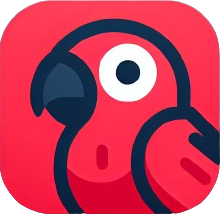

# 👋🏼 Hi there

I'm currently the **lead software engineer** at Evexia Inc. building a *real* revolution in mental health.

I code mostly for the web using technologies like JavaScript, TypeScript, Python, React, React Native, HTML, CSS, Node, Express.js, Next.js, Svelte, SvelteKit, SQL, PostgresSQL, and MySQL. Yeah, that's a lot, but such is the web these days. However, I love going deep particularly on understanding the eccentricities and capabilities of JavaScript and the web APIs. I use Git and GitHub to manage my software versioning.

I currently live in Hamilton, Ontario, Canada (near Toronto if you're from outside Canada), but I'm open to opportunities around the world!

## Things About Me

- I started developing for the web when pixel-perfection was still viable, Flash ruled the world, responsive design was just a twinkle in Ethan Marcotte's eye, and tables were used for basically everything.
- I attended a Bachelor of Arts in Psychology and a Master of Arts in Counselling Psychology at Wilfrid Laurier University and Yorkville University, respectively.
  - Don't worry. I can't read minds...yet.
- I also love food, cooking, board games, puzzles, escape rooms, travel, and exploring other cultures.
- I'm currently learning Dutch and Hebrew.

## Places I've Worked

### Evexia Inc. | Lead Software Engineer

AUG 2024 - PRESENT

Named after the Greek word for "wellness", we are striving to bridge the gap between the amount of therapy we need and the amount of therapists and mental health providers there are. We're building a new approach to therapy and making supplemental resources for mental health to help tackle the growing crisis.

As the lead software engineer, I architect and build the app and website using TypeScript, React, React Native, Firebase, and other web/mobile-native solutions.

### PlayToday | Back-End Developer

MAY 2024 - AUG 2024

PlayToday is an app to encourage customer engagement, retention, and satisfaction for a global property management company by providing an all-in-one solution for new residents to become accustomed to their new residences and residential areas.

As the solo back-end developer, I engineered a robust Express.js-based REST API including JWT-based authentication, CRUD operations with Azure database integration via MongoDB and Mongoose, and public API key generation and usage. In addition, the app includes a robust logging and access tracking system and the ability to stream CSVs to automatically parse and generate data.

### makeitMVP | Junior Software Engineer

MAR 2024 - MAY 2024

As part of a cross-functional team, I collaborated with designers and a project manager to develop a comprehensive member management tool/dashboard, using React and Firebase, to streamline community operations for organizations and their community managers.

## Things I've Made

### Theme Editor (name wip)

An app for devs and designers to collaborate on, create, modify, and share color and design systems for their website/app's components.

**Buult with**: Next.js, TypeScript, React, Tailwind CSS, Shadcn/UI, and passion.

[https://shadcn.taylorsabbag.com](https://shadcn.taylorsabbag.com)

### LinguaFrankly 

An app for acquiring second-languages through the power of optimal input via daily short stories.

**Built with**: SvelteKit (Svelte 5), Supabase, PostgreSQL, DeepL, OpenAI GPT 4, TypeScript, Tailwind CSS, and love.

[https://linguafrankly.taylorsabbag.dev](https://linguafrankly.taylorsabbag.dev)

### My Portfolio/Blog

Really just a repeat of this page but more ✨*magical*✨.

**Built with**: Next.js, React, TypeScript, MDX, Tailwind CSS, and hope.

[https://taylorsabbag.dev](https://taylorsabbag.dev)

## Things I've Written

*Behold, my digital scrolls of wisdom! These mystical texts are automatically summoned from my personal grimoire through ancient RSS enchantments:*

| 📜 Scroll Title | 🌟 Date of Enchantment | 🔮 Magical Synopsis |
|-----------------|----------------------|-------------------|
| [Why You Should Learn FizzBuzz: The Quiet (In)Dignity of a Simple Interview Question](https://taylorsabbag.dev/blog/fizzbuzz) | 2023-06-24 | An exploration of the best and possibly worst solutions for a child's game. |

