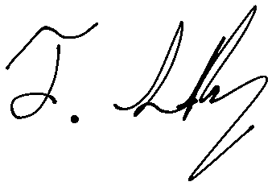

# 👋🏼 Hi, I'm Taylor Sabbag

I convince ancient, compressed dinosaur smoothies to power my portable zap-rectangle, which whispers binary secrets through *sparkly* noodles to my desk-dwelling thunder-cabinet. By frantically tapping on these letter-squares made of fossilized prehistoric juice, I conjure digital spells that transform caffeine into features.

Through this mystical process of keyboard divination and electron-herding, I hope to craft digital enchantments that make your existence more magical. If not, I shall continue communing with the silicon spirits until the code-gods smile upon my offerings.

## Places You Can Find/Contact Me

**Email**: <a href="mailto:taylorsabbag@gmail.com">taylorsabbag@gmail.com</a>

**LinkedIn**: <a href="https://www.linkedin.com/in/taylor-sabbag" target="_blank" rel="noopener noreferrer">https://www.linkedin.com/in/taylor-sabbag</a>

## Things About Me

- I'm currently the **Lead Software Engineer** at Evexia Inc., where we're building the next-generation of mental health support software.
- I started developing for the web when pixel-perfection was still viable, Flash ruled the world, responsive design was just a twinkle in Ethan Marcotte's eye, and tables were used for basically everything.
- I attended a Bachelor of Arts in Psychology and a Master of Arts in Counselling Psychology.
  - Don't worry. I can't read minds...yet.
- I can craft incantations in **JavaScript, TypeScript, Python, and SQL** (including MySQL and PostgreSQL).
- I've also performed digital rituals for **HTML, CSS, Tailwind CSS, React, React Native, Node, Express.js, Next.js, Svelte, and SvelteKit**.
- I'm skilled in the art of parallel universe management using **Git and GitHub**.
- I'm a full-stack sorcerer who has mastered both the frontend and backend realms.
- I also love food, cooking, board games, puzzles, escape rooms, travel, and exploring other cultures.
- I'm currently learning Dutch and Hebrew.

## Things I've Made

### LinguaFrankly 

An app for acquiring second-languages through the power of optimal input via daily short stories. Built with SvelteKit (Svelte 5), Supabase, PostgreSQL, DeepL, OpenAI GPT 4, TypeScript, Tailwind CSS, and love.

[https://linguafrankly.taylorsabbag.dev](https://linguafrankly.taylorsabbag.dev)

### My Portfolio/Blog 

Really just a repeat of this page but more ✨*magical*✨. Built with Next.js, React, TypeScript, MDX, Tailwind CSS, and hope.

[https://taylorsabbag.dev](https://taylorsabbag.dev)

## Things I've Written

